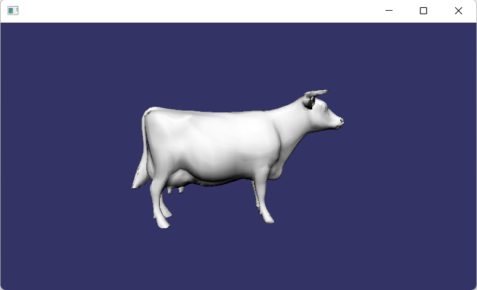

# osg GL3 配置的编译

	author: longlongwaytogo
	date: 2022/07/12	
	email: longlongway2012@hotmail.com		
	repo: https://github.com/longlongwaytogo/LearnOsgGL3
		
## 准备工作
- 下载osg最新版本

	git clone git@github.com:openscenegraph/OpenSceneGraph.git
	
- 下载osg基于vs2019_x64的第三方库(感谢osg版主freesouth的编译)
	
	[来自freesouth版主的链接](https://freesouth.blog.csdn.net/article/details/121093781)
	
- 下载OpengGL头文件
	

		git clone git@github.com:KhronosGroup/OpenGL-Registry.git
	
- 下载 egl头文件

		git clone git@github.com:KhronosGroup/EGL-Registry.git
	
## 编译
-  拷贝头文件：
	- copy OpenGL-Registry\api\GL目录至OpenSceneGraph\include目录下  
	- copy EGL-Registry\api\KHR目录至OpenSceneGraph\include目录下  

		如图：

		
	
- 解压第三方库
- 运行cmake-gui进行配置
	- 在opensceneGraph目录下指定binary目录为build_vs2019_x64_GL3
	- 设置ACTUAL_3RDPARTY_DIR目录为3rdparty所在路径
	- search中输入opengl,设置opengl头文件为glcorearb.h,如下图：
		
		
- 设置osg中对OpenGL的支持：
	
	- 启用的配置：	
		 - OSG_GL3_AVAILABLE

	- 禁用的配置：
		
		- OSG_GL1_AVAILABLE
		- OSG_GL2_AVAILABLE
		- OSG_GLES1_AVAILABLE
		- OSG_GLES2_AVAILABLE
		- OSG_GL_DISPLAYLISTS_AVAILABLE
		- OSG_GL_FIXED_FUNCTION_AVAILABLE
		- OSG_GL_MATRICES_AVAILABLE
		- OSG_GL_VERTEX_ARRAY_FUNCS_AVAILABLE
		- OSG_GL_VERTEX_FUNCS_AVAILABLE
	 
	 如图所示：
	 
	 

	- 设置编译BUILD_OSG_EXAMPLES 选项
	- 设置WIN32_USE_MP 加速编译速度
	- 点击genrate，打开sln工程进行编译

- 错误修复：
	
	可能出现无法编译，找不到GL_COMPRESSED_RGB_S3TC_DXT1_EXT，需要注释掉Texture头文件第60行,因为该宏被glcorearb.h已经定义过了：

		//#ifndef GL_EXT_texture_compression_s3tc
			#define GL_COMPRESSED_RGB_S3TC_DXT1_EXT         0x83F0
			#define GL_COMPRESSED_RGBA_S3TC_DXT1_EXT        0x83F1
			#define GL_COMPRESSED_RGBA_S3TC_DXT3_EXT        0x83F2
			#define GL_COMPRESSED_RGBA_S3TC_DXT5_EXT        0x83F3
			#define GL_COMPRESSED_SRGB_S3TC_DXT1_EXT        0x8C4C
			#define GL_COMPRESSED_SRGB_ALPHA_S3TC_DXT1_EXT  0x8C4D
			#define GL_COMPRESSED_SRGB_ALPHA_S3TC_DXT3_EXT  0x8C4E
			#define GL_COMPRESSED_SRGB_ALPHA_S3TC_DXT5_EXT  0x8C4F
		//#endif
	
- copy 第三发库 dll到bin目录下
- 运行  例子中的 osgsimplegl3：
  
		osgsimplegl3 cow.osg
	如图：
	 
	