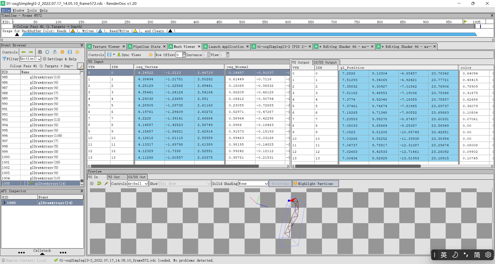

# osgSimplegl3例子分析

	author: longlongwaytogo
	date: 2022/07/18
	email: longlongway2012@hotmail.com		
	repo: https://github.com/longlongwaytogo/LearnOsgGL3

# 简介
上一篇文章介绍了osg自带的osgSimple3例子，现在对它进行一定的修改，使其运行在gl 3.3 core模式下。

# 主要修改有以下几个地方

- 设置gl 3.3版本和启用core模式
```cpp

    const std::string version( "3.3" );
    osg::ref_ptr< osg::GraphicsContext::Traits > traits = new osg::GraphicsContext::Traits();
    traits->x = 20; traits->y = 30;
    traits->width = width; traits->height = height;
    traits->windowDecoration = true;
    traits->doubleBuffer = true;
    traits->glContextVersion = version;
    traits->glContextProfileMask = GL_CONTEXT_CORE_PROFILE_BIT;// 0x1;// 

```

- 删除兼容代码：

```cpp
        // for non GL3/GL4 and non GLES2 platforms we need enable the osg_ uniforms that the shaders will use,
        // you don't need thse two lines on GL3/GL4 and GLES2 specific builds as these will be enable by default.
        gc->getState()->setUseModelViewAndProjectionUniforms(true);
        gc->getState()->setUseVertexAttributeAliasing(true);
```


- 修改shader版本为将#version 330
```cpp
       const std::string vertexSource =
        "#version 330 \n"
        " \n"
        "uniform mat4 osg_ModelViewProjectionMatrix; \n"
        "uniform mat3 osg_NormalMatrix; \n"
        "uniform vec3 ecLightDir; \n"
        " \n"
        "in vec4 osg_Vertex; \n"
        "in vec3 osg_Normal; \n"
        "out vec4 color; \n"
        " \n"
        "void main() \n"
        "{ \n"
        "    vec3 ecNormal = normalize( osg_NormalMatrix * osg_Normal ); \n"
        "    float diffuse = max( dot( ecLightDir, ecNormal ), 0. ); \n"
        "    color = vec4( vec3( diffuse ), 1. ); \n"
        " \n"
        "    gl_Position = osg_ModelViewProjectionMatrix * osg_Vertex; \n"
        "} \n";
    osg::Shader* vShader = new osg::Shader( osg::Shader::VERTEX, vertexSource );

    const std::string fragmentSource =
        "#version 330 \n"
        " \n"
        "in vec4 color; \n"
        "out vec4 fragData; \n"
        " \n"
        "void main() \n"
        "{ \n"
        "    fragData = color; \n"
        "} \n";

  ```


- 设置投影矩阵和顶点属性引用，但这句代码只在gl3以前的版本中需要，真正开发gl3版本的osg程序不需要以下代码
  
```cpp
   // for non GL3/GL4 and non GLES2 platforms we need enable the osg_ uniforms that the shaders will use,
    // you don't need thse two lines on GL3/GL4 and GLES2 specific builds as these will be enable by default.
    gc->getState()->setUseModelViewAndProjectionUniforms(true);
    gc->getState()->setUseVertexAttributeAliasing(true);
```

- 兼容osg原有顶点数据布局位置：

```cpp
    /*osgvertexattributes.cpp
     // mappings taken from http://www.opengl.org/registry/specs/NV/vertex_program.txt
    _vertexAlias = AttributeAlias(0, "osg_Vertex");
    _normalAlias = AttributeAlias(2, "osg_Normal");
    _colorAlias = AttributeAlias(3, "osg_Color");
    _secondaryColorAlias = AttributeAlias(4, "osg_SecondaryColor");
    _fogCoordAlias = AttributeAlias(5, "osg_FogCoord");
    _texCoordAlias[0] = AttributeAlias(8, "osg_MultiTexCoord0");
    _texCoordAlias[1] = AttributeAlias(9, "osg_MultiTexCoord1");
    _texCoordAlias[2] = AttributeAlias(10, "osg_MultiTexCoord2");
    _texCoordAlias[3] = AttributeAlias(11, "osg_MultiTexCoord3");
    _texCoordAlias[4] = AttributeAlias(12, "osg_MultiTexCoord4");
    _texCoordAlias[5] = AttributeAlias(13, "osg_MultiTexCoord5");
    _texCoordAlias[6] = AttributeAlias(14, "osg_MultiTexCoord6");
    _texCoordAlias[7] = AttributeAlias(15, "osg_MultiTexCoord7");
    */
    // 兼容osg原有顶点数据布局位置
    gc->getState()->resetVertexAttributeAlias(false);
    
```

- 使用RenderDoc抓帧分析： 
  
    - Renderdoc支持gl 3.3以后版本的OpenGL，可以实现渲染数据的记录和再现，便于分析和查错。虽然不能支持单步调试，但可以修改着色器实时看到修改后的运行结果。

    - 使用RenderDoc抓帧的界面，在程序上会显示额外的ui界面，显示Fame数目，刷新频率,抓帧快捷键F12(printscreen也可以抓帧)等信息，按下F12即可捕获一帧的渲染数据，下图为修改后的osgSimple3抓帧结果：


    - 点击查看捕获的数据，选择textureViewer,左侧可以看到渲染阶段的api调用，中间为当前选中缓冲区，右侧显示colorbuffer和depethbuffer资源预览图:

    - 点击pipeline state 可以查看不同的渲染阶段，如选中vs查看顶点shader

   - 顶点shader预览窗口：

  - 顶点Mesh Viewer预览窗口,可以查看渲染模型的网格信息：


- 总结：
  
   使用opengl 3.3以后的版本，结合RenderDoc等调试工具可以对开发起到事半功倍的作用，又是百思不得其解的问题，一看就知道错在哪里，感慨工具开发者必然也是被折么的无法忍受，在想着通过捕获渲染api接口和数据的思路，来分析和重现整个渲染流程。
   
