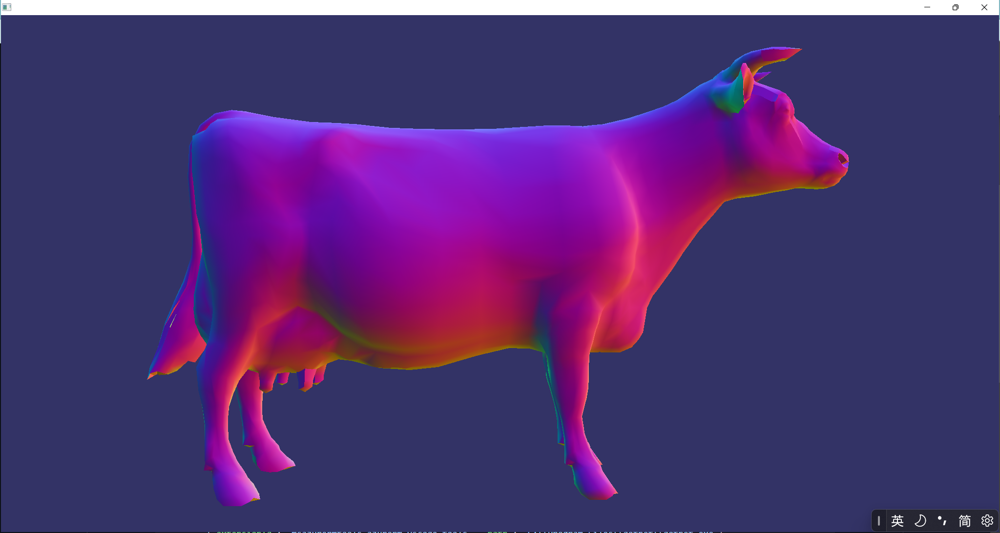
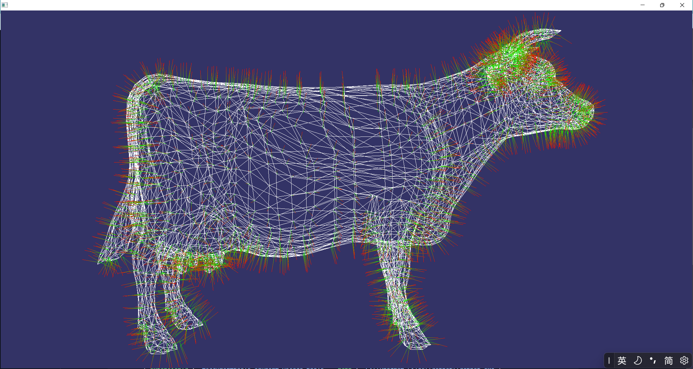
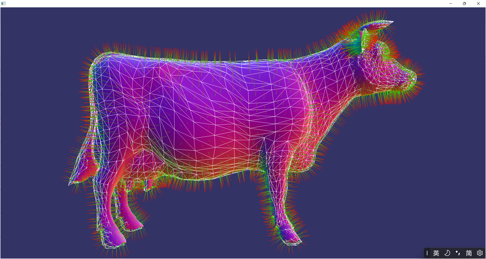
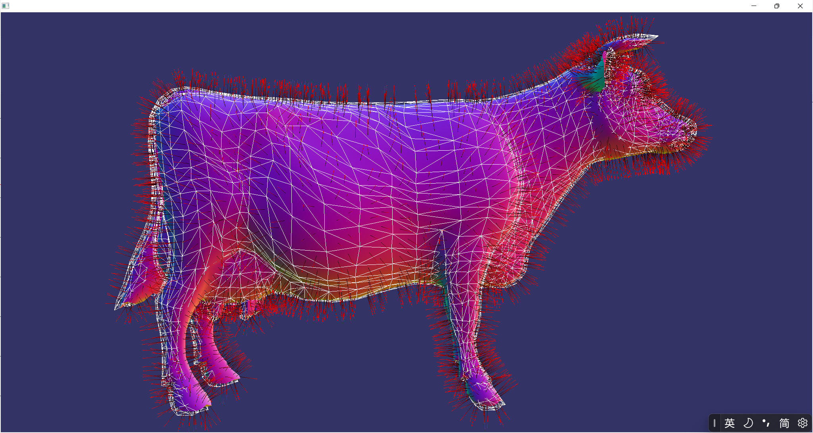

# 法线可视化

	author: longlongwaytogo
	date: 2022/07/20
	email: longlongway2012@hotmail.com		
	repo: https://github.com/longlongwaytogo/LearnOsgGL3

## 简介
    法线针对光照计算有着重要的意义，但有时候，很难直观的检查计算的光照效果是否正确.有时感觉怪怪的，但也不知道是否是错误，我们可以将发现图显示到输出，但更直观的是，直接将法线绘制出来。

## 显示法线的多种方法
- 显示颜色法线
- 显示顶点法线
- 显示面的法线

## 显示颜色法线
颜色法线的显示，只需要将顶点着色器中的法线传递到片段中进行显示即可,但必须要注意，法线的取值范围为[-1,1]，颜色缓冲区范围为[0,1],必须要进行范围转换映射，通常使用P*.5+0.5将[-1,1]映射到[0,1],具体代码如下：

```cpp
    const std::string vs =
        "#version 330 \n"
        "uniform mat4 osg_ModelViewProjectionMatrix; \n"
        "uniform mat3 osg_NormalMatrix; \n"
        "uniform mat4 osg_ViewMatrixInverse;\n"
        "uniform mat4 osg_ModelViewMatrix;\n"
        "in vec4 osg_Vertex; \n"
        "in vec3 osg_Normal; \n"
        "out vec4 color;\n"
        "void main() \n"
        "{ \n"
        "   vec3 ecNormal;// = normalize( osg_NormalMatrix * osg_Normal ); \n"
        "   gl_Position = osg_ModelViewProjectionMatrix * osg_Vertex; \n"
        //"   vec4 pos = gl_Position/gl_Position.w;\n"
        // "   color =  vec4(pos.xyz,1.0);\n"
        "   mat4 modelMatrix = osg_ViewMatrixInverse * osg_ModelViewMatrix;\n"
        "   ecNormal = mat3(modelMatrix) * osg_Normal;\n"
        "   ecNormal = ecNormal*0.5 + 0.5;\n"
        "   color =  vec4(ecNormal,1.0);\n"
        "} \n";

    const std::string fs =
        "#version 330 \n"
        "in vec4 color;\n"
        "out vec4 fragData; \n"
        "void main() \n"
        "{ \n"
        "    fragData = color; \n"
        "} \n";
```
效果如下图：

## 显示顶点法线
  逐个顶点法线，是opengl常用的法线输入方式，应用程序向GPU传递顶点属性时，大部分都是每个顶点绑定一个独立法线，不过OpenGL也支持传递逐个面的法线，但对于着色器程序，后者也是关联到每个顶点上来计算的，逐顶点的法线可视化，可以针对每个顶点，沿着各自法线方向一定距离，绘制一条线段。但要生成每个顶点的法线，我们需要用到几何着色器，几何着色可以很方便的生成、删除顶点或者修改图元类型，这样就可以将绘制面的图元转换为绘制直线的图元，具体代码如下：
```cpp

    #version 330  
    uniform mat4 osg_ModelViewProjectionMatrix;  
    uniform mat3 osg_NormalMatrix;
    uniform float normal_length;
    uniform int show_normal_mode;
    in vec3 local_normal[];
    out vec4 color;
    layout(triangles) in;
    layout(line_strip,max_vertices = 8) out;
    void main()  
    { 
        for(int i = 0; i < gl_in.length(); i++)
        {
            vec4 P0 = gl_in[i].gl_Position;
            gl_Position = osg_ModelViewProjectionMatrix * P0;
            color = vec4(0,1,0,1);
            EmitVertex();

            vec4 N = vec4(local_normal[i],0.0);
            vec4 P1 = gl_in[i].gl_Position + N * normal_length;//normal_length ;
            color = vec4(1,0,0,1);
            gl_Position = osg_ModelViewProjectionMatrix * P1;
            EmitVertex();
            EndPrimitive();
        }
    }
```

效果如下图：

## 显示面的法线
显示面的法线有两种方式：
-   显示每个图元的平均法线
-   显示基于右手定则叉乘两条边计算法线

### 显示每个图元的平均法线
显示每个图元的平均法线，我们只需要将多个顶点先相加求得面的中心坐标，然后将各个顶点的法线相加求得平均法线，从中心点出发，沿着法线的方向产生一条直线即可，代码如下：
```cpp
    int n = gl_in.length();
    if(n >2)
    {
        vec4 P0 = gl_in[0].gl_Position;
        vec4 P1 = gl_in[1].gl_Position;
        vec4 P2 = gl_in[2].gl_Position;
        vec4 N0 = (P0 + P1 + P2) / 3.0;
        color = vec4(0,1,0,1);
        gl_Position = osg_ModelViewProjectionMatrix * N0;
        EmitVertex();

        vec3 n = (local_normal[0] + local_normal[1] + local_normal[2])/3.0;
        vec4 delta = vec4(n * normal_length,0);
        vec4 NP0 = N0 + delta;
        
        color = vec4(1,0,0,1);
        gl_Position = osg_ModelViewProjectionMatrix * NP0;
        EmitVertex();

        EndPrimitive();
    }	
``` 
效果如下图：

### 显示基于右手定则叉乘两条边计算法线
使用叉乘法线，需要按照右手定则，找到图元的两条边，按照逆时针（WCC）顺序叉乘得到一条法线（但geometry中无法知道当前的面序是否是CCW，这里只是演示下叉乘的方式),代码如下：
```cpp

    // face normal
    vec3 P0 = gl_in[0].gl_Position.xyz;
    vec3 P1 = gl_in[1].gl_Position.xyz;
    vec3 P2 = gl_in[2].gl_Position.xyz;
    // Center of the triangle
    vec3 P = (P0+P1+P2) / 3.0;

    vec3 V0 = P0 - P1;
    vec3 V1 = P2 - P1;

    vec3 N = cross(V1, V0);
    N = normalize(N);

    gl_Position = osg_ModelViewProjectionMatrix * vec4(P, 1.0);
    color = vec4(0, 0, 0, 1);
    EmitVertex();

    gl_Position = osg_ModelViewProjectionMatrix * vec4(P + N * normal_length, 1.0);
    color = vec4(1, 0, 0, 1);
    EmitVertex();
    EndPrimitive();
```
效果如下图：

# 总结

以上讲解了几种法线的生成算法，具体的几何着色器知识并未细讲，需要自行补充知识。除此，计算面法线，也未能清楚知道当前的面方向是GL_CCW还是GL_CW，gl_FrontFacing内置变量只能在片段着色器中使用，这个还需要以后查阅资料来补充。
 

 # 欢迎关注公众号   
	
